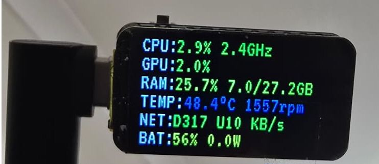

# PC Hardware Monitor for ESP32-C6

Real-time PC hardware monitoring displayed on an ESP32-C6 with 1.47" ST7789 LCD. Monitors CPU, RAM, temperature, GPU, network, fan speed, and battery stats via serial communication.


## Hardware Requirements

- **ESP32-C6-LCD-1.47** (ESP32-C6 DevKit with ST7789 1.47" display)
- USB cable for serial communication
- Linux PC with hardware sensors

## Setup

### 1. ESP32 Firmware

Install PlatformIO and upload firmware:

```bash
# Install PlatformIO (if not already installed)
pip install platformio

# Build and upload to ESP32-C6
pio run -t upload

# Optional: Monitor serial output
pio device monitor
```

### 2. PC Monitor Script

Install Python dependencies:

```bash
pip install pyserial
```

Run the monitor script:

```bash
python3 pc_monitor.py
```

The script will:
- Auto-detect the ESP32 device on `/dev/ttyACM*` or `/dev/ttyUSB*`
- Read system metrics from `/proc`, `/sys`, and GPU drivers
- Send data to ESP32 every second

### 3. Optional: Systemd Service

To run the monitor automatically on boot:

```bash
# Edit the service file paths to match your setup
nano pc-hardware-monitor.service

# Install service
sudo cp pc-hardware-monitor.service /etc/systemd/system/
sudo systemctl daemon-reload
sudo systemctl enable pc-hardware-monitor.service
sudo systemctl start pc-hardware-monitor.service

# Check status
sudo systemctl status pc-hardware-monitor.service
```

## Features

- **CPU Usage** - Real-time CPU percentage
- **RAM Usage** - Memory utilization and total/used GB
- **Temperature** - CPU temperature via k10temp sensor
- **GPU Usage** - AMD/NVIDIA GPU utilization
- **Network Stats** - Download/upload speeds
- **Fan Speed** - System fan RPM
- **Battery** - Battery percentage and power draw
- **Power Saving** - Auto-dim display when PC disconnects

## Display Layout

The circular UI shows all metrics with icons and real-time updates. When disconnected, the display enters power-saving mode with reduced backlight.

## Troubleshooting

- **Device not found**: Check USB connection and permissions (`sudo usermod -a -G dialout $USER`)
- **No temperature**: Ensure k10temp kernel module is loaded
- **No GPU stats**: Install appropriate GPU drivers (amdgpu/nvidia-smi)
- **Permission denied**: Run with sudo or add user to dialout group
